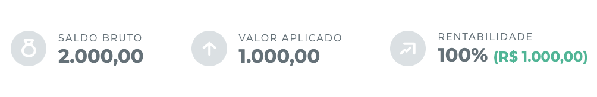

# Kinvo Profitability Amount Chrome Extension
---
[](https://coveralls.io/github/salesgu/kinvo-profitability-amount-chrome-extension)
---
## Resultado


## Motivação


## O que é
Infelizmente a feature não foi desenvolvida de forma nativa, porém como eu gosto de saber o valor que tenho de rentabilidade, eu decidi criar essa extensão do Google Chrome (ou Brave) para exibir o valor em reais da rentabilidade da carteira selecionada.

## Features

- Exibir o valor da rentabilidade e aplicando a cor verde se for maior ou igual a zero e a cor vermelha se for menor que zero

## Install

Por enquanto ainda é manual, você pode executar o `yarn build` e [subir a pasta build manualmente](https://developer.chrome.com/docs/extensions/mv3/getstarted/#manifest) na sessão de extensões do Chrome/Brave.

## Contribution

Feedbacks e pull requests são bem vidas!

### Rodando o projeto

#### Tempo de desenvolvimento
```
yarn install
yarn watch
```

#### Tempo de build
```
yarn build
```

#### Rodando extensão como desenvolvedor
A Google tem um [artigo que explica como colocar o pacote pra rodar](https://developer.chrome.com/docs/extensions/mv3/getstarted/#manifest). O processo deve ser feito com o `yarn watch`.

#### Testes
```
yarn test
```

## Me siga nas redes sociais!

[](https://twitter.com/gussalesdev)
[](https://www.instagram.com/gussales.dev/)
[](https://canal.gsales.io)
[](https://www.linkedin.com/in/gsaless/)
[](https://gsales.io)

---

This project was bootstrapped with [Chrome Extension CLI](https://github.com/dutiyesh/chrome-extension-cli)

